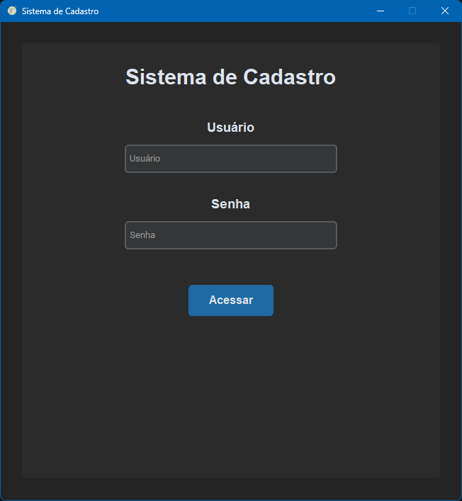
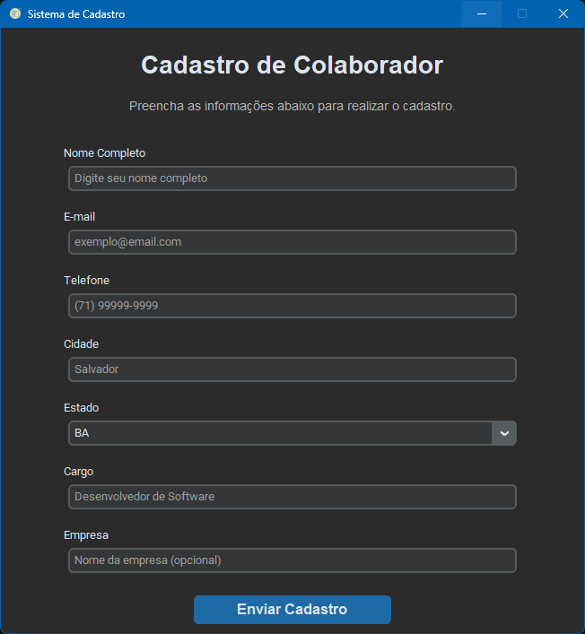

# 📝 Sistema de Cadastro

Aplicação desktop desenvolvida em **Python** utilizando **CustomTkinter**, simulando um sistema de autenticação e cadastro de colaboradores.

Este projeto faz parte dos meus estudos em desenvolvimento de interfaces gráficas (GUI) com Python e será evoluído gradualmente com novas funcionalidades.

---

## ✨ Funcionalidades (v1)

- Tela de login
- Interface moderna utilizando CustomTkinter
- Autenticação com usuário e senha fixos
- Formulário de cadastro de colaborador
- Campos para:
  - Nome
  - E-mail
  - Telefone
  - Cidade
  - Estado
  - Cargo
  - Empresa
- Feedback visual após o envio do cadastro
- Atalho pelo teclado (Enter) para realizar o login

---

## 🚀 Próximas versões

### ✅ v1
- Interface gráfica
- Login fixo
- Formulário de cadastro

### 🔜 v2
- Validação completa dos campos
- Verificação de e-mail
- Máscara para telefone
- Campos obrigatórios

### 🔜 v3
- Integração com Google Sheets
- Armazenamento automático dos cadastros

### 🔜 v4
- Envio automático de e-mail
- Cadastro de usuários
- Login utilizando usuários cadastrados

---

## 🛠 Tecnologias

- Python
- CustomTkinter
- Tkinter

---

## 📁 Estrutura

```text
sistema-cadastro/
│
├── assets/
│   ├── icon_form.ico
│   ├── login_screen.png
│   └── register_screen.png
├── .gitignore
├── app.py
├── README.md
└── requirements.txt
```

---

## ▶ Como executar

Clone o repositório:

```bash
git clone https://github.com/daianaq/sistema-cadastro.git
```

Entre na pasta:

```bash
cd sistema-cadastro
```

Instale as dependências:

```bash
pip install -r requirements.txt
```

Execute a aplicação:

```bash
python app.py
```

---

## 📷 Demonstração

### Tela de Login



### Tela de Cadastro

